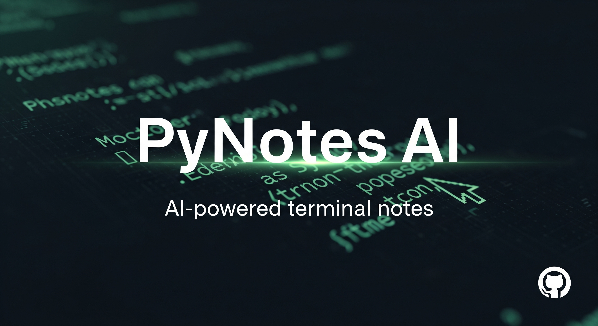

# PyNotes AI
*A terminal-based, AI-powered notepad for the modern developer.*

---



**PyNotes AI** is a sophisticated, terminal-based note-taking application built with Python and Textual. It seamlessly integrates the power of large language models like Google's Gemini to provide a fast, keyboard-driven workflow for capturing ideas and getting intelligent assistance without ever leaving your terminal.

## Features

* **Efficient Note Management**: Create, edit, save, and delete notes with simple key presses.
* **Intelligent Naming**: Notes are automatically named based on their first line of content, with dynamic renaming if you change it later.
* **Integrated AI**: A dedicated panel allows you to query an AI model.
* **Rich Text Output**: The AI's responses are rendered in beautiful, formatted markdown directly in the terminal.
* **Secure API Key Handling**: On the first run, the app prompts for your Google Gemini API Key and stores it locally and securely in `.gemini_api_key` (which is git-ignored).
* **Customizable Theming**: Use Textual's built-in command palette (`Ctrl+P`) to choose from a variety of themes. Set your favorite as the default.
* **Vim-like Experience**: A keyboard-centric design with intuitive keybindings for a fast, mouse-free workflow.

## Installation Guide

Follow these steps to get PyNotes AI running on your system.

### Step 1: Prerequisites (Install Python & Pip)

You need Python 3.8 or newer to run this application.

<details>
<summary><strong>► Windows Instructions</strong></summary>

1.  **Download Python**: Go to the [official Python website](https://www.python.org/downloads/) and download the latest version.
2.  **Run the Installer**:
    * Launch the installer executable.
    * **Crucial Step**: On the first screen of the installer, check the box that says **"Add Python to PATH"**.
    * Click "Install Now" and proceed through the installation.
3.  **Verify Installation**: Open a new Command Prompt or PowerShell and type `python --version`. If it shows the version you installed, you are all set.

</details>

<details>
<summary><strong>► macOS Instructions</strong></summary>

The best way to install and manage Python on macOS is with [Homebrew](https://brew.sh/).

1.  **Install Homebrew** (if you don't have it): Open your terminal and run:
    ```bash
    /bin/bash -c "$(curl -fsSL [https://raw.githubusercontent.com/Homebrew/install/HEAD/install.sh](https://raw.githubusercontent.com/Homebrew/install/HEAD/install.sh))"
    ```
2.  **Install Python**: Once Homebrew is ready, run:
    ```bash
    brew install python
    ```
3.  **Verify Installation**: Open a new terminal window and type `python3 --version`. You should see the latest version.

</details>

<details>
<summary><strong>► Linux Instructions</strong></summary>

Most Linux distributions come with Python 3 pre-installed. You can verify with `python3 --version`. If you need to install it or `pip`, use your distribution's package manager.

* **For Debian/Ubuntu**:
    ```bash
    sudo apt update && sudo apt install python3 python3-pip python3-venv
    ```
* **For Fedora/CentOS/RHEL**:
    ```bash
    sudo dnf install python3 python3-pip
    ```
* **For Arch Linux**:
    ```bash
    sudo pacman -S python python-pip
    ```
</details>

### Step 2: Get the PyNotes AI Code

Clone this repository to your local machine and navigate into the directory.

```bash
git clone [https://github.com/YOUR_USERNAME/PyNotesAI.git](https://github.com/YOUR_USERNAME/PyNotesAI.git)
cd PyNotesAI
```
*(Replace `YOUR_USERNAME/PyNotesAI` with the actual path to your repository)*

### Step 3: Install Dependencies

Install the required Python libraries using the `requirements.txt` file. It's highly recommended to do this within a virtual environment.

```bash
# Optional: Create and activate a virtual environment
python3 -m venv venv
source venv/bin/activate  # On Windows, use `venv\Scripts\activate`

# Install dependencies
pip install -r requirements.txt
```

## Running the Application

Once the dependencies are installed, you can run the application with:

```bash
python main.py
```
On the first run, you will be prompted to enter your Google Gemini API Key. This is stored locally in a `.gemini_api_key` file.

### Creating a Launch Alias (Recommended)

To run PyNotes AI from anywhere with a simple command (e.g., `pynotesai`), you can create a terminal alias.

<details>
<summary><strong>► macOS & Linux (Bash/Zsh)</strong></summary>

1.  Open your shell's configuration file (`~/.zshrc` for Zsh, or `~/.bashrc` for Bash).
    ```bash
    # For Zsh (default on modern macOS)
    nano ~/.zshrc
    ```
2.  Add the following line at the end of the file. Remember to replace `/path/to/your/PyNotesAI` with the **actual absolute path** to the project folder.
    ```bash
    alias pynotesai="python3 /path/to/your/PyNotesAI/main.py"
    ```
3.  Save the file, close it, and apply the changes by running `source ~/.zshrc` or simply opening a new terminal window.

</details>

<details>
<summary><strong>► Windows (PowerShell)</strong></summary>

1.  Open PowerShell and edit your profile file by running:
    ```powershell
    notepad $PROFILE
    ```
    *(If this command gives an error, it means the file doesn't exist yet. Run `New-Item -Path $PROFILE -Type File -Force` to create it, then run the notepad command again).*
2.  Add the following function to the file. Remember to replace `C:\path\to\your\PyNotesAI` with the **actual absolute path** to the project folder.
    ```powershell
    function Pynotesai {
        python C:\path\to\your\PyNotesAI\main.py
    }
    ```
3.  Save and close the file. You may need to update your execution policy by running PowerShell as an **Administrator** and entering: `Set-ExecutionPolicy RemoteSigned`.
4.  Restart PowerShell. You can now launch the app by typing `Pynotesai`.

</details>

## Usage Guide

### Keybindings

| Key         | Action                                       |
| :---------- | :------------------------------------------- |
| `n`         | Create a new, empty note.                    |
| `Ctrl+S`    | Save the current note.                       |
| `Ctrl+D`    | Delete the currently highlighted note.       |
| `Tab`       | Cycle focus forward through panels.          |
| `Shift+Tab` | Cycle focus backward through panels.         |
| `Ctrl+P`    | Open the command palette (to switch themes). |
| `Ctrl+F`    | Forget the stored Gemini API Key.            |
| `Ctrl+E`    | Manually enter a new Gemini API Key.         |
| `Enter`     | (In AI Input) Send the query to the AI.      |

### API Key Management
Your Google Gemini API Key is stored in a file named `.gemini_api_key` in the project root. This file is included in `.gitignore` to prevent it from being accidentally committed to your repository.

### Notes Directory
All your notes are stored as plain text files in the `notes/` directory within the project folder.
